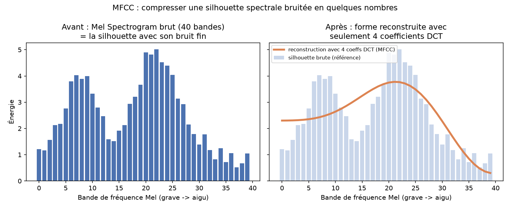

# Les caractéristiques (features) audio extraites

Le tutoriel extrait 4 features via `librosa`, toutes basées sur une représentation **fréquentielle** du signal (pas la waveform brute `y`) :

1. MFCC
2. Mel Spectrogram
3. Chroma
4. Tonnetz

## Du domaine temporel au domaine fréquentiel

La waveform `y` représente l'amplitude en fonction du temps. Pour extraire des features utiles à la classification, on passe à une représentation fréquentielle via la **FFT (Fast Fourier Transform)**, appliquée par morceaux glissants sur le signal (STFT — Short-Time Fourier Transform). Ça produit un **spectrogramme** : axe X = temps, axe Y = fréquence, intensité = énergie à cette fréquence à cet instant.

Toutes les features du tutoriel dérivent de ce spectrogramme.

## L'échelle Mel et le Mel Spectrogram

Le spectrogramme classique a un axe de fréquence **linéaire** (en Hz). Or l'oreille humaine perçoit les fréquences de façon **logarithmique** (même principe qu'en musique : une octave = fréquence × 2, peu importe la fréquence de départ — le saut perçu entre 100 Hz et 200 Hz est le même qu'entre 1000 Hz et 2000 Hz).

L'**échelle Mel** reprojette l'axe des fréquences pour coller à cette perception : elle étire la résolution sur les basses fréquences (où l'oreille est précise) et la compresse sur les hautes fréquences (où l'oreille distingue moins bien).

Le **Mel Spectrogram** (`librosa.feature.melspectrogram`) = le spectrogramme (STFT), avec l'axe des fréquences reprojeté sur l'échelle Mel via un banc de filtres (*Mel filterbanks*).

**Pourquoi c'est utile pour la classification :**
- **Réduction de dimensionnalité intelligente** : moins de détail conservé dans les aigus (zone perceptuellement moins riche), donc moins de données à traiter sans perdre l'essentiel.
- Représentation qui correspond à un espace **perceptif** plutôt que purement physique, ce qui donne empiriquement de meilleurs résultats pour les tâches audio (parole, musique...).

Point de vigilance : ce n'est pas parce que "les basses portent plus d'info sur le genre musical" que l'échelle Mel les favorise — c'est parce qu'elle suit le fonctionnement de l'oreille humaine, indépendamment du contenu musical. Les deux se recoupent souvent en pratique, mais la cause est perceptive, pas musicale.

## MFCC (Mel Frequency Cepstral Coefficients)

Le Mel Spectrogram donne, à un instant T fixe, une série de valeurs d'énergie (une par bande de fréquence Mel, ex. 40 valeurs). Si on trace ça (axe X = fréquence, axe Y = énergie), on obtient une **silhouette** — comme un profil de chaîne de montagnes : des pics là où il y a des résonances physiques (*formants* — corps de l'instrument, conduit vocal), des creux ailleurs.

**Le problème :** cette silhouette contient de la redondance. Une résonance physique n'amplifie jamais une seule fréquence isolée, elle amplifie toute une zone autour — donc les bandes voisines sont **corrélées** (si une bande a beaucoup d'énergie à cause d'une résonance, ses voisines directes en ont probablement aussi). 40 valeurs brutes, c'est plus d'information que nécessaire pour décrire cette forme.

**Ce que fait le MFCC :** il applique une **DCT (Discrete Cosine Transform)** sur cette silhouette, ce qui la redécrit avec une poignée de coefficients (13 à 20) au lieu de 40 valeurs brutes. C'est le même principe qu'une compression JPEG d'image : on garde les traits **grossiers** de la forme (où sont les grosses bosses = le timbre) et on jette le bruit fin/les détails non pertinents.

- Coefficient 1 : hauteur moyenne globale de la silhouette.
- Coefficient 2 : penche-t-elle plutôt vers les graves ou les aigus.
- Coefficients suivants : de plus en plus de détail sur la forme, jusqu'à devenir du bruit non pertinent (d'où l'arrêt à 13-20 coefficients).

### Illustration

Données fictives (deux formants + bruit) pour illustrer le principe :
- **Gauche** : la silhouette brute sur 40 bandes, avec ses deux pics (formants) et son bruit fin.
- **Droite** : la même silhouette (en clair, pour référence) et sa reconstruction (en orange) à partir de seulement 4 coefficients DCT (volontairement peu, pour bien voir l'effet de lissage — en pratique on en garde 13-20, ce qui conserverait mieux les deux pics distincts).

La courbe reconstruite suit la tendance générale (où se concentre l'énergie) mais lisse le bruit fin et perd un peu de résolution sur les détails (les deux pics se distinguent moins bien avec seulement 4 coefficients).

**En résumé :** MFCC = une poignée de nombres qui résument la forme générale du spectre à un instant donné (le timbre), en éliminant la redondance et le bruit fin d'une silhouette de 40 valeurs brutes.

## Chroma

Principe : regrouper toute l'énergie du spectre par **classe de hauteur** (pitch class), en additionnant ensemble toutes les octaves d'une même note. Toutes les occurrences de "Do" (C2, C3, C4...) tombent dans le même bin, pareil pour "Do#", "Ré", etc.

Résultat : un vecteur de **12 valeurs** (les 12 demi-tons de la gamme chromatique), qui représente le contenu harmonique/tonal du morceau à un instant donné — indépendamment de l'octave et du timbre. C'est l'équivalent audio d'un accord vu comme un ensemble de notes, peu importe l'octave.

**Fonction** : `librosa.feature.chroma_stft(y=y, sr=sr)`.

### Chroma vs MFCC : complémentarité

Les deux sont calculés à un instant T fixe (pas de notion temporelle), mais capturent des aspects différents et complémentaires du son :
- **Chroma** : quelles notes/accords sont joués → info **harmonique/tonale** (utile pour déterminer une clé, une progression d'accords).
- **MFCC** : à quoi ça ressemble sonoremement (quels instruments, quelle texture) → info **timbrale**, indépendamment de la hauteur jouée.

Point de vigilance : ni l'un ni l'autre ne capture le **rythme/tempo** — ce serait le rôle d'autres fonctions non utilisées dans ce tutoriel (ex. `librosa.beat.tempo`, `librosa.onset.onset_detect`).

## Tonnetz (Tonal Centroid Features)

Le Tonnetz part du vecteur Chroma (12 valeurs) et le **reprojette** via une transformation linéaire fixe sur un espace à **6 dimensions** représentant les relations d'intervalles musicaux : les notes qui "sonnent bien ensemble" (quintes, tierces) se retrouvent proches dans cet espace, les notes dissonantes en sont éloignées. Concept issu du *Tonnetz* de la théorie musicale historique (réseau tonal utilisé depuis le 18e siècle, formalisé notamment par Riemann).

**Fonction** : `librosa.feature.tonnetz(y=y, sr=sr)`.

### Point important : le Tonnetz n'ajoute pas d'information par rapport au Chroma

Le Tonnetz est calculé à partir du Chroma via une **fonction fixe** (transformation linéaire, 12 → 6 dimensions). Une fonction fixe ne peut jamais créer de l'info qui n'était pas déjà dans son entrée — au mieux elle la réarrange, au pire elle en perd (ici on passe de 12 à 6 dimensions, donc perte probable). Donc le Chroma contient tout ce qu'il y a dans le Tonnetz, et même un peu plus — pas l'inverse.

**Alors pourquoi garder les deux features ?** Question de représentation, pas de contenu :
- Dans le **Chroma**, les 12 bins sont des cases indépendantes — rien dans la structure ne dit au modèle que "Do" et "Sol" (quinte, consonant) sont musicalement proches. Le modèle devrait apprendre cette relation à partir des exemples.
- Dans le **Tonnetz**, cette relation est déjà encodée géométriquement : deux notes consonantes tombent proches dans l'espace à 6 dimensions (distance euclidienne courte), directement lisible sans apprentissage.

Donc les deux sont donnés au modèle : le Chroma (info brute complète) + le Tonnetz (même info, mais avec les relations de consonance déjà "pré-mâchées" géométriquement) — utile notamment pour un modèle simple (pas de CNN qui apprendrait ces relations tout seul).

### Les 6 dimensions en détail

Elles forment **3 paires de coordonnées**, une paire par cercle d'intervalle :

1. **Cercle des quintes** (*circle of fifths*) → 2 dimensions.
2. **Cercle des tierces mineures** → 2 dimensions.
3. **Cercle des tierces majeures** → 2 dimensions.

**Pourquoi 2 dimensions par cercle et pas 1 ?** Un cercle "boucle" (après Si, on revient à Do). Représenter la position avec un seul angle créerait une discontinuité artificielle entre les deux bords du cercle. En utilisant `(cos θ, sin θ)` — 2 coordonnées — cette coupure disparaît et la distance géométrique reste cohérente tout autour du cercle.

Chaque note du Chroma a une position sur chacun des 3 cercles (ex. sur le cercle des quintes, Do et Sol sont voisins ; sur celui des tierces majeures, Do et Mi sont voisins). Le Tonnetz combine la contribution de chaque note (pondérée par son énergie dans le Chroma) sur les 3 cercles simultanément → un point dans un espace à 6 dimensions, où un accord parfait (quinte + tierce) se traduit par des points regroupés, et un cluster dissonant par des points dispersés.
