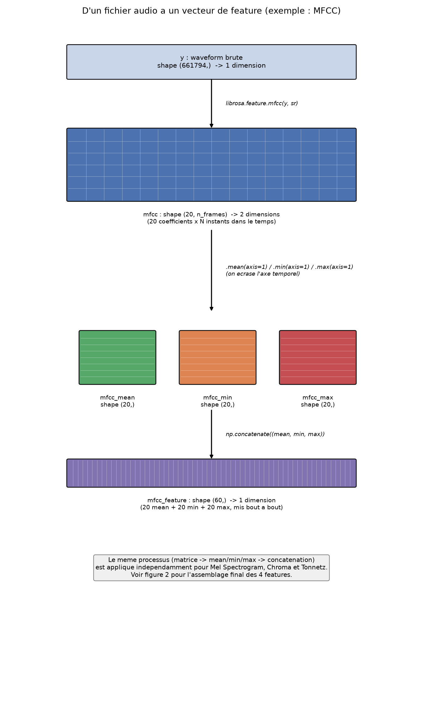
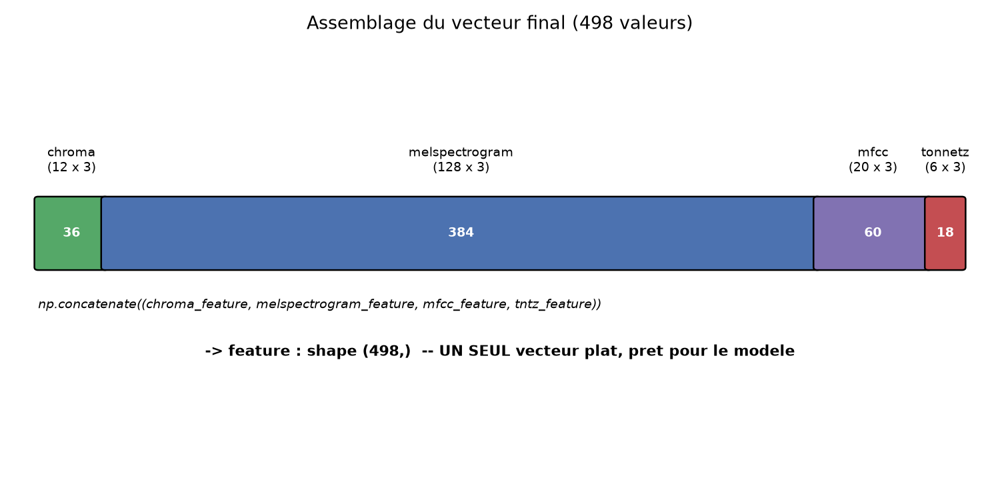

# La logique de collecte des features

## Le problème : une taille de vecteur fixe pour le modèle

Chaque feature extraite (MFCC, Mel Spectrogram, Chroma, Tonnetz) a une forme `(n_coefficients, n_frames)` — `n_frames` correspond au nombre d'instants temporels analysés, et dépend de la durée du morceau (et des paramètres de la STFT sous-jacente).

Un modèle ML "classique" (réseau dense, modèle scikit-learn...) a besoin d'un **vecteur d'entrée de taille fixe et identique pour tous les exemples**. On ne peut pas lui donner un vecteur de taille variable selon la durée du morceau — il faut donc compresser la dimension temporelle (`n_frames`) en une représentation de taille fixe, quelle que soit la durée réelle.

## Pourquoi mean/min/max ?

Ce sont trois statistiques calculées sur l'axe temporel, qui transforment `(n_coefficients, n_frames)` en 3 × `(n_coefficients,)` — taille fixe, peu importe `n_frames` au départ. Chacune capture une info différente et complémentaire :

- **mean** : la valeur "typique" de ce coefficient sur tout le morceau — la tendance centrale.
- **min** / **max** : l'étendue de variation de ce coefficient au cours du morceau. Utile car deux morceaux peuvent avoir la même moyenne mais une dynamique très différente (constant vs alternance calme/intense) — l'info de variation serait perdue avec la seule moyenne.

## Pourquoi concaténer tout en un seul vecteur plat ?

`np.concatenate` fusionne mean/min/max d'une feature, puis les 4 features entre elles, en un seul vecteur 1D de 498 valeurs (12 chroma + 128 mel + 20 mfcc + 6 tonnetz, chacun ×3 pour mean/min/max = (12+128+20+6)×3 = 498).

C'est le format attendu en entrée par un réseau de neurones dense (ou un modèle scikit-learn classique) : un vecteur plat, sans structure explicite. On perd la lisibilité (impossible de voir directement où s'arrête le MFCC et où commence le Chroma dans le vecteur final) — mais le modèle n'en a pas besoin : il apprend simplement des poids associés à chacune des 498 positions du vecteur.

### Visualisation : d'un fichier audio à un vecteur de feature

À chaque étape, le nombre de dimensions du tableau change :

1. **`y` (waveform)** : 1 dimension, 661 794 nombres (un par échantillon audio).
2. **`librosa.feature.mfcc(y, sr)`** : 2 dimensions — une grille/matrice de 20 lignes (coefficients) × `n_frames` colonnes (un instantané toutes les quelques millisecondes). Une colonne = une "silhouette spectrale" à un instant T (cf. le schéma du MFCC plus haut dans le cours).
3. **`.mean(axis=1)` / `.min(axis=1)` / `.max(axis=1)`** : on écrase la dimension temporelle (les colonnes) en une seule statistique par ligne. On repasse de 2 dimensions (20 × n_frames) à 1 dimension (20 valeurs), répété 3 fois → 3 vecteurs de 20 valeurs.
4. **`np.concatenate`** : les 3 vecteurs sont mis bout à bout → un vecteur de 60 valeurs qui résume tout le morceau pour le MFCC.

Ce même processus (grille → 3 vecteurs → 1 vecteur) est répété indépendamment pour les 3 autres features (Mel Spectrogram : 128 coefficients, Chroma : 12, Tonnetz : 6).

### Visualisation : l'assemblage du vecteur final

Une fois que chaque feature a produit son propre vecteur (chroma=36, melspectrogram=384, mfcc=60, tonnetz=18), un dernier `np.concatenate` les met bout à bout en **un seul vecteur de 498 valeurs**.

### Organisation exacte du vecteur final

`np.concatenate` empile les tableaux les uns après les autres dans l'ordre donné — **jamais d'entrelacement**. L'ordre utilisé dans le code (`np.concatenate((chroma_feature, melspectrogram_feature, mfcc_feature, tntz_feature))`) donne cette organisation par blocs contigus :

| Index dans le vecteur | Contenu |
|---|---|
| 0 – 35 | **chroma** (36 valeurs) |
| 36 – 419 | **mel spectrogram** (384 valeurs) |
| 420 – 479 | **mfcc** (60 valeurs) |
| 480 – 497 | **tonnetz** (18 valeurs) |

Et à l'intérieur de chaque bloc, même logique de blocs contigus (pas d'alternance entre mean/min/max) — exemple pour le bloc mfcc (60 valeurs, index 420-479) :

| Sous-index | Contenu |
|---|---|
| 420 – 439 | 20 valeurs de **mean** |
| 440 – 459 | 20 valeurs de **min** |
| 460 – 479 | 20 valeurs de **max** |

## La structure `features` / `labels`

Structure de base de l'**apprentissage supervisé** : pour chaque exemple, une entrée (`features[i]`, le vecteur de 498 valeurs) et une sortie attendue (`labels[i]`, le genre). Les deux listes avancent strictement en parallèle.

**Point de vigilance** : c'est pour ça que le `try/except` autour de l'extraction doit garantir qu'on ajoute les deux ensemble, ou aucun des deux — jamais un décalage entre `features` et `labels` (sinon `features[i]` correspondrait au mauvais label pour tous les `i` suivants).

`label = genres.index(genre)` convertit le nom du genre (string) en entier (0 pour "blues", 1 pour "classical", etc.), car un modèle ne manipule que des nombres, jamais du texte brut. Cet entier n'a pas de sens d'ordre (le genre 3 n'est pas "plus grand" que le genre 1) — c'est un simple identifiant de catégorie (**label encoding**). À ne pas confondre avec le **one-hot encoding** (un vecteur binaire par exemple, une position à 1 pour la bonne classe et 0 ailleurs), notion qu'on croisera probablement au moment de préparer les labels pour l'entraînement PyTorch.